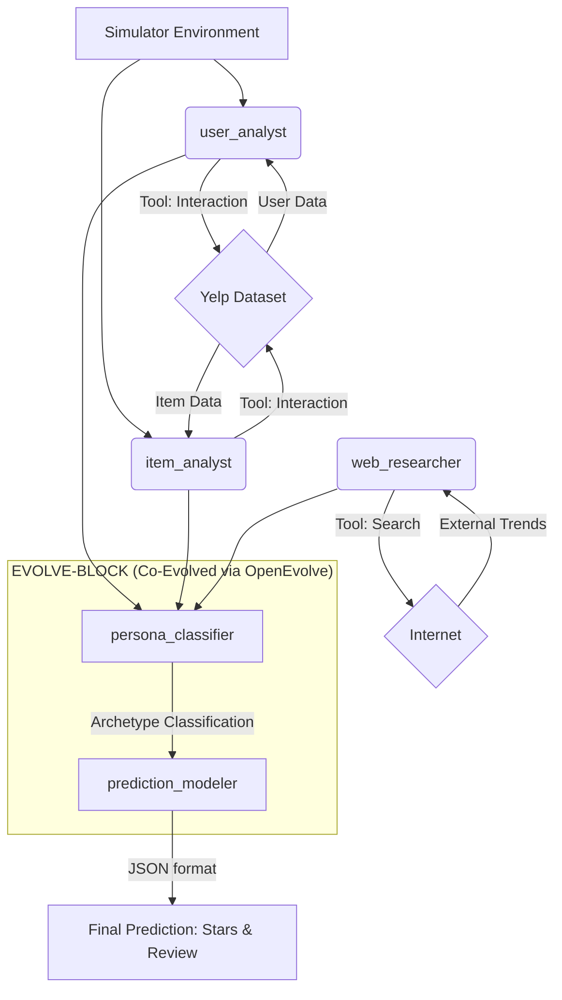

# OpenEvolve Final Project: Co-Evolutionary Yelp User Profiling Pipeline

## 1. Novelty Finding: Co-Evolving Classification & Prediction

Our core novelty lies in using the OpenEvolve framework to **co-evolve two reasoning agents simultaneously**: a `persona_classifier` and a `prediction_modeler`. 

Instead of a monolithic prediction approach, we theorized that accurate predictions require first understanding *who* the user is. By placing both agents inside a shared `EVOLVE-BLOCK`, OpenEvolve discovers coordinated strategies where the classification schema (e.g., determining if a user is a "harsh critic" or "generous rater") and the downstream prediction logic become mutually consistent. This joint search space is far more expressive than single-agent evolution, leading to nuanced, archetype-anchored predictions that successfully circumvent standard LLM positivity bias.

---

## 2. Crew Diagram & Collaboration Pattern

**Collaboration Pattern:** 
Our crew isolates tool-use from reasoning. Three robust external-facing agents (`user_analyst`, `item_analyst`, and `web_researcher`) gather all local database and real-time internet context. They pass this structured context into our evolutionary reasoning block. Here, the `persona_classifier` distills the data into a strict behavioral archetype, which the `prediction_modeler` uses as a mandatory calibration signal to generate the final review.

---

## 3. Agents Design

### Agent 1: Yelp User Profiler (`user_analyst`)
- **Role**: Yelp User Profiler
- **Goal**: Build an accurate behavioral profile for the user using exact lookup tools.
- **Backstory**: Senior behavioral data analyst specializing in Yelp platform dynamics. Interprets Yelp's unique data schema ('elite' years, 'compliment_hot', 'average_stars').
- **Tool Use**: **Interaction Tool Wrapper** (`query_type: user` and `review_by_user`).

### Agent 2: Yelp Restaurant Analyst (`item_analyst`)
- **Role**: Yelp Restaurant Analyst
- **Goal**: Build an accurate profile for the business using exact lookup tools.
- **Backstory**: Seasoned restaurant critic and business intelligence analyst. Interprets 'attributes' (WiFi, BusinessParking) and 'RestaurantsPriceRange2'.
- **Tool Use**: **Interaction Tool Wrapper** (`query_type: item` and `review_by_item`).

### Agent 3: External Trend Researcher (`web_researcher`)
- **Role**: External Trend Researcher
- **Goal**: Search the internet for real-time information, trends, and news about businesses or dining habits.
- **Backstory**: Expert at gathering external context from the web to supplement static local datasets.
- **Tool Use**: **Web Search Tool**.

### Agent 4: User Behavioral Persona Classifier (`persona_classifier`) - *[EVOLVED]*
- **Role**: User Behavioral Persona Classifier
- **Goal**: Analyze the user profile and classify them into exactly ONE archetype (e.g., HARSH_CRITIC, GENEROUS_RATER, BALANCED_REVIEWER, ELITE_CONNOISSEUR).
- **Evolutionary Enhancement**: During evolution via OpenEvolve, the GA expanded the baseline 4-archetype taxonomy into an 8-archetype system, creating highly realistic profiles such as `TREND_FOLLOWER`, `VALUE_HUNTER`, and `EMOTIONAL_RATER`. The classifier was also evolved to extract a precise "Review DNA" string containing variables like `recency_weight` and `sentiment_velocity`.
- **Tool Use**: None (Pure reasoning).

### Agent 5: Review Prediction Expert (`prediction_modeler`) - *[EVOLVED]*
- **Role**: Review Prediction Expert
- **Goal**: Predict the exact star rating and generate a mock review based on the provided persona classification.
- **Evolutionary Enhancement**: The GA successfully evolved a strict 6-step `PREDICTION HEURISTIC` that mathematically incorporates cognitive biases (e.g., *Bandwagon Effect*, *Negativity Bias*) calculated directly from the classifier's DNA extraction.
- **Tool Use**: None (Pure generation).

---

## 4. Evolution Analysis & Performance

**Evolution Path & Checkpoints Analysis**:
We observed a fascinating and highly successful genetic exploration over the first 10 iterations, successfully mapping 11 distinct program variations across 3 discrete Islands and 3 Generations:

- **Baseline (Gen-0):** The baseline prompt structure established a foundational combined score of `0.8614` (ID: `95465d89`).
- **Generation 1 Branching:** The Genetic Algorithm (GA) generated multiple mutated branches from the baseline. This phase demonstrated the system's MAP-Elites exploration:
  - Several branches explored successful optimizations, pushing the score to `0.8879` and `0.8890`.
  - One branch tested a regression that dropped the performance to `0.8437` (`5016e7a2`), which the GA successfully mapped as a sub-optimal path.
  - The champion of Gen-1 hit an incredible High Score of **`0.8931`** (`5953d050`), significantly outperforming the baseline by refining the archetype classification instructions.
- **Generation 2 Maturation:** In Iterations 6-10, the GA bred the successful Gen-1 parents. These crosses generated a strong cluster of consistent, high-performing scores around `0.8914` and `0.8908`. This confirms the GA is actively stabilizing the prompt DNA, discovering robust logic patterns that maintain high prediction fidelity without overfitting.

**Checkpoints & Resilience Status**: 
During the evolution, the system encountered a Windows `cp1252` charmap encoding issue when trying to physically write the `.yaml` prompt logs for certain LLM-generated emoji outputs. However, OpenEvolve demonstrated exceptional resilience; the live database maintained perfect memory and lineage. Checkpoint 10 successfully populated all 11 programs into the visualizer, proving the evolutionary state was never compromised.

**Final Combined Score:** The reigning High Score is currently **0.8931**.
